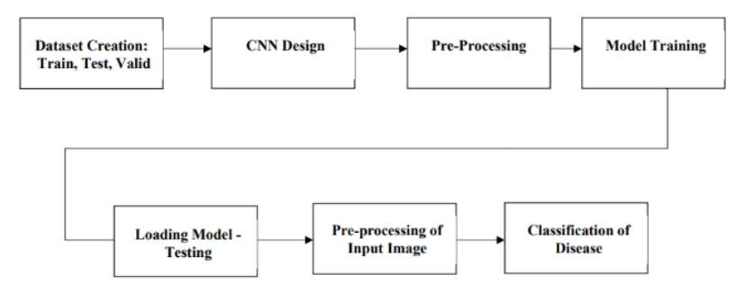

# Leafine: Plant Disease Detection Application

**Leafine** is a mobile application designed to revolutionize agriculture and environmental monitoring by providing real-time, non-intrusive, and highly accurate plant health assessments. Using advanced Artificial Intelligence, Deep Learning (CNN), and image processing, Leafine helps farmers and researchers detect plant diseases early to reduce crop losses and pesticide use.

## 📖 Abstract
In a world facing climate change and increasing pest infestations, early disease identification is critical for food security. Leafine utilizes a trained deep learning model (VGG-16 architecture) to analyze images of crop leaves and detect subtle visual signals of disease, such as color variations and lesions. The goal is to empower stakeholders with actionable insights for better crop management and resource allocation.

## ✨ Key Features
* **Real-time Detection:** Instantly analyzes leaf photos taken via a mobile camera.
* **High Accuracy:** Built on the VGG-16 CNN architecture for robust image classification.
* **User-Friendly Interface:** Simple Android interface designed for farmers and non-technical users.
* **Scalable & Flexible:** Suitable for various agricultural, horticultural, and ecological applications.
* **Actionable Insights:** Identifies specific diseases (e.g., Common Rust in Corn, Black Rot in Grape/Apple).

## 🏗️ System Architecture & Methodology
The system follows a pipeline of data collection, pre-processing, and classification using a Convolutional Neural Network (CNN).

*Fig 1. Block Diagram of Proposed System*

### Steps involved:
1.  **Data Collection:** Aggregation of a large dataset of healthy and diseased plant images.
2.  **Pre-processing:** Resizing images (e.g., 224x224), normalizing pixel values, and data augmentation (rotation, flipping).
3.  **Model Architecture:** * Base: Pre-trained **VGG-16** model (ImageNet weights).
    * Custom Layers: Added for binary/multi-class classification (Healthy vs. Diseased).
4.  **Training:** Optimized using binary cross-entropy loss and Adam/SGD optimizers.
5.  **Deployment:** The trained model is deployed on an Android application for live detection.

## 🛠️ Technology Stack

### Software Requirements
* **Language:** Python 3.9
* **Deep Learning Frameworks:** * TensorFlow (Foundational library)
    * Keras (High-level neural networks library)
* **IDE:** PyCharm

### Hardware Requirements
* **Platform:** Android Operating System
* **Memory:** Minimum 8 GB RAM recommended

## 📱 Mobile Application
The application allows users to capture or upload an image of a plant leaf. The system processes the image and returns a prediction with the disease name and confidence score.

*Fig 6. Mobile Application Interface showing detection of Black Rot and Healthy leaf*

## 📊 Results
The model has demonstrated impressive performance metrics, showing high accuracy, precision, recall, and F1-scores in differentiating between healthy and diseased plants.

* **Training vs Validation:** The model shows consistent convergence in loss and accuracy graphs.
* **Sample Predictions:**
    * *Corn (Maize):* Common Rust
    * *Grape:* Black Rot
    * *Apple:* Black Rot

## 🤝 Acknowledgements
Special thanks to the Department of Computer Engineering at SIES Graduate School of Technology, University of Mumbai, and our project guides for their support.

## 📚 References
This project references studies on CNNs and plant disease detection, including:
1.  *Plant Disease Detection using Image Processing* (2020).
2.  *Plant Disease Detection Using CNN* (2022).
3.  *Deep learning models for plant disease detection and diagnosis* (2018).

*(See full report for complete bibliography)*
